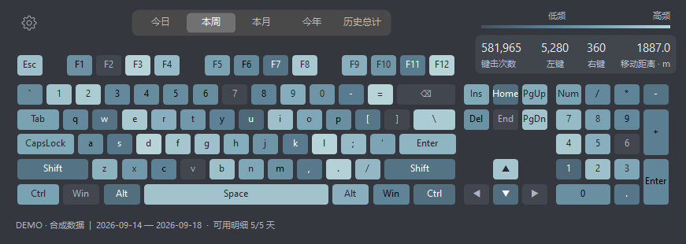
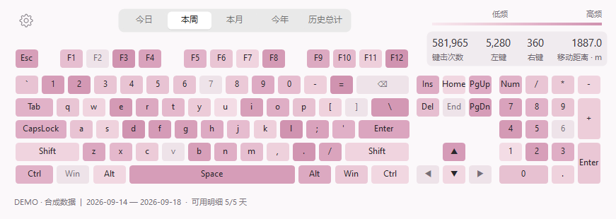
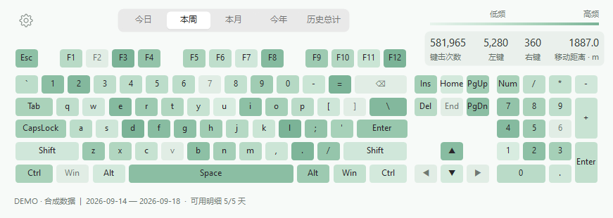
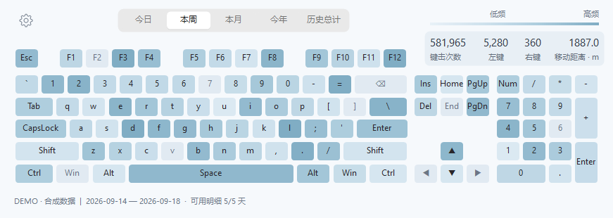
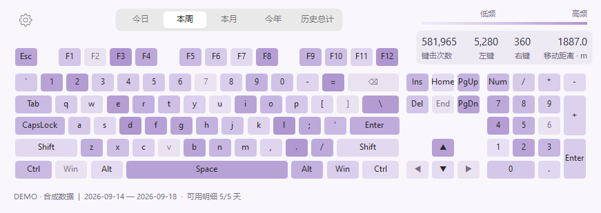
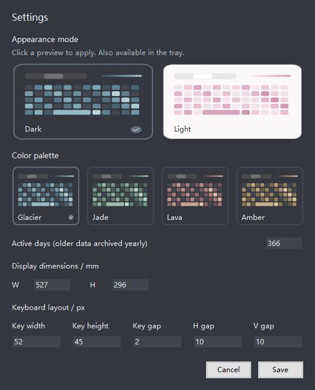
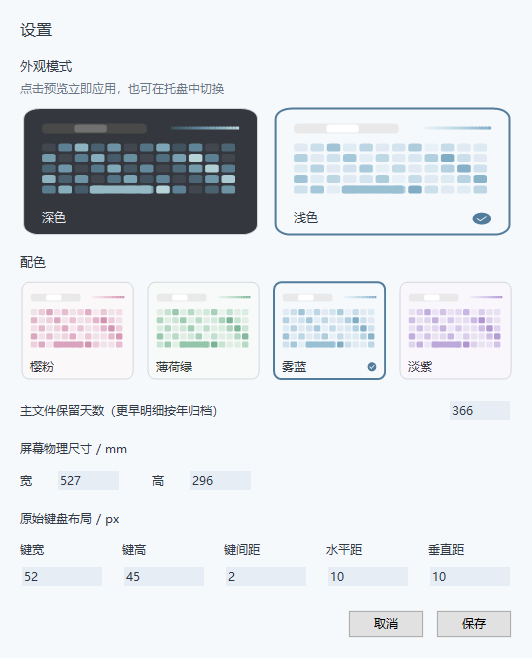

# KMCounter

一款轻巧的 Windows 键鼠使用热力图工具：实时统计、对数热度、Dark / Light 外观，以及与背景协调的四套浅色配色。

A compact Windows keyboard and mouse heatmap with logarithmic intensity, one-click date ranges, and coordinated dark/light palettes.

基于 [telppa/KMCounter](https://github.com/telppa/KMCounter) 改造，保留原项目历史，并重新设计了界面、配色与历史数据管理。



## 界面与配色

先选择 **Dark / Light**，再选择模式下的配色。Dark 保留冰川青、翡翠、熔岩、琥珀；Light 提供樱粉、薄荷绿、雾蓝、淡紫，背景、统计区和键帽使用协调的同色系。

| 樱粉 · Blossom | 薄荷绿 · Mint |
| --- | --- |
|  |  |

| 雾蓝 · Mist blue | 淡紫 · Lilac |
| --- | --- |
|  |  |

设置中可以直接预览并选择外观，与托盘选项同步。两种模式分别记住上次的配色，支持中文和 English。

<p align="center">
  
  
</p>

以上图片均由本版程序使用合成演示数据生成，不包含个人键鼠记录。

## 功能

- **对数热力图**：采用 `ln(1 + count) / ln(1 + max)`，让使用次数相差几个数量级的按键仍能区分。
- **点选时间范围**：今日、本周、本月、今年、历史总计。
- **独立鼠标统计**：左键、右键分别计数，展示移动距离；悬停可查看中键、侧键与滚轮细项。
- **轻量桌面界面**：紧凑布局、圆角键帽、独立灰阶时间选择和低对比度统计面板。
- **历史分段存储**：主文件默认保留最近 366 天，更早的每日明细按年归档；历史总计独立累计。
- **本地运行**：统计和设置保存在程序目录，关闭窗口后仍可驻留托盘。

## 开始使用

1. 从 [Releases](https://github.com/zhangh8976/KMCounter/releases) 下载 `KMCounter.exe`，放到一个可写目录。
2. 双击 exe，打开主界面并开始统计，无需另外安装 AutoHotkey。
3. 点击左上角齿轮调整设置；关闭窗口后继续在托盘运行，从托盘选择“退出”保存并结束。

数据保存在 exe 同目录的 `KMCounter.ini` 和 `history/` 中。升级时先退出旧版，再替换 exe，保留这两个位置即可延续数据。

`--background` 仅启动托盘；`--demo` 使用合成数据展示界面，不记录输入、不写入个人统计。

## 从源码构建

运行环境：Windows，AutoHotkey **v1.1.37.02 Unicode 64-bit**。已在 Windows 10 上验证；项目使用 Windows 原生控件和 GDI+ 绘制。

在项目根目录打开 PowerShell：

```powershell
# 获取官方便携运行时与编译器，无需系统安装
.\tools\SetupRuntime.ps1

# 运行数据与界面检查
.\tools\Test.ps1

# 生成根目录的 KMCounter.exe
.\tools\Build.ps1
```

源码结构：`KMCounter.ahk` 为程序入口，`Lib/` 包含绘制、配色、存储和语言逻辑，`tests/` 包含数据及界面检查。

更多细节见 [使用与存储说明](PREVIEW.md)。

## 致谢

- 原项目与作者：[telppa/KMCounter](https://github.com/telppa/KMCounter)
- 原项目致谢：[fwt](https://www.autoahk.com/archives/35133)、[SKAN](https://www.autoahk.com/boards/viewtopic.php?f=6&t=76881)、[just me](https://github.com/AHK-just-me)、[robodesign](https://github.com/marius-sucan)
